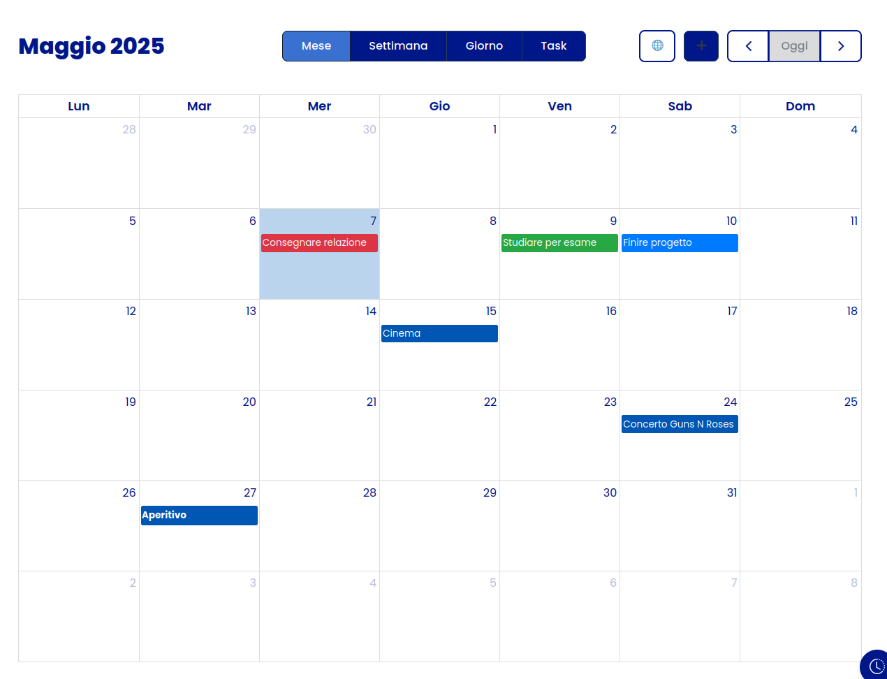
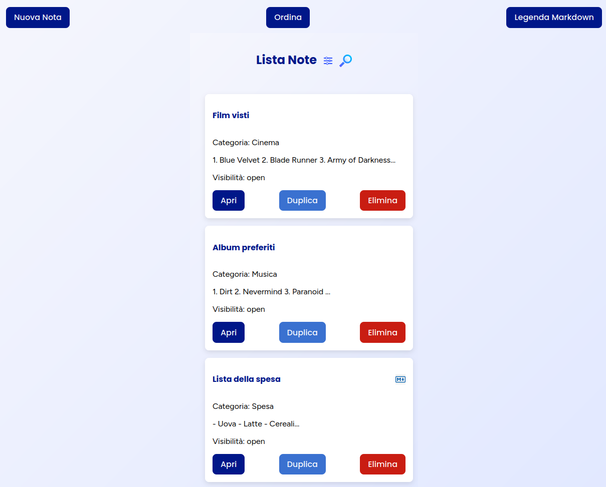
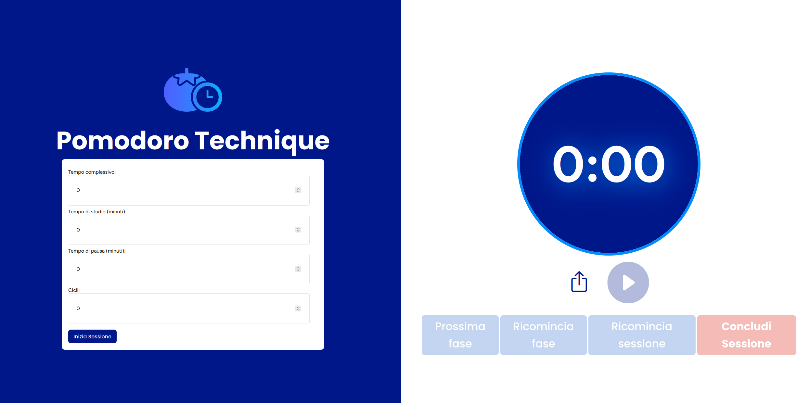

# Selfie

Full-stack web application for uni project.





---

## Project Description

Through Selfie, a student is able to plan his/her private, social and academic life in a flexible and complete way.

Selfie is a MERN stack web application that can be used equally from both a mobile phone and a PC, organized in modules that provide support for different types of events, deadlines, notes, messages and much more.

Main features:

- Calendar
- Notes
- Pomodoro timer
- Profile
- Time Machine

---

## Getting Started

This project runs **locally**. Follow the steps below to get it up and running on your machine.

### Prerequisites

* [Node.js](https://nodejs.org/)
* [MongoDB Atlas](https://www.mongodb.com/cloud/atlas)
* A Gmail account for sending emails (or any email service that supports SMTP)

---

### Installation & Setup

1. **Clone the repository**

   ```bash
   git clone https://github.com/lorenzocasalinii/Selfie
   cd Selfie
   ```

2. **Set up the environment variables**

   Create a `.env` file inside the `/server` directory and paste the following:

   ```env
   DB_URI=your_mongodb_connection_string
   JWT_SECRET=your_super_secret_key
   EMAIL_USER=your_email@example.com
   EMAIL_PASS=your_app_password
   ```

   ⚠️ *Replace the placeholders with your actual credentials.*

   > 🔒 For security reasons, we do not include actual credentials. Please create your own MongoDB Atlas cluster and an email account (preferably a no-reply Gmail account with [App Passwords](https://support.google.com/accounts/answer/185833) enabled).

3. **Install dependencies**

   Move to the **server** directory:

   ```bash
   cd server
   npm install
   ```

   Then move to the **client** directory:

   ```bash
   cd ../client
   npm install
   ```

---

### Running the Project

Open **two terminals**, one for the server and one for the client:

* **Terminal 1 (Server)**

  ```bash
  cd server
  npm run dev
  ```

* **Terminal 2 (Client)**

  ```bash
  cd client
  npm start
  ```

The client will run on `http://localhost:3000`, and the server will run on `http://localhost:8000`.

---

## Authors

* Lorenzo Casalini - lorenzo.casalini4@studio.unibo.it
* Gianluca Casaburi - gianluca.casaburi@studio.unibo.it
* Vittorio Zedda - vittorio.zedda@studio.unibo.it
